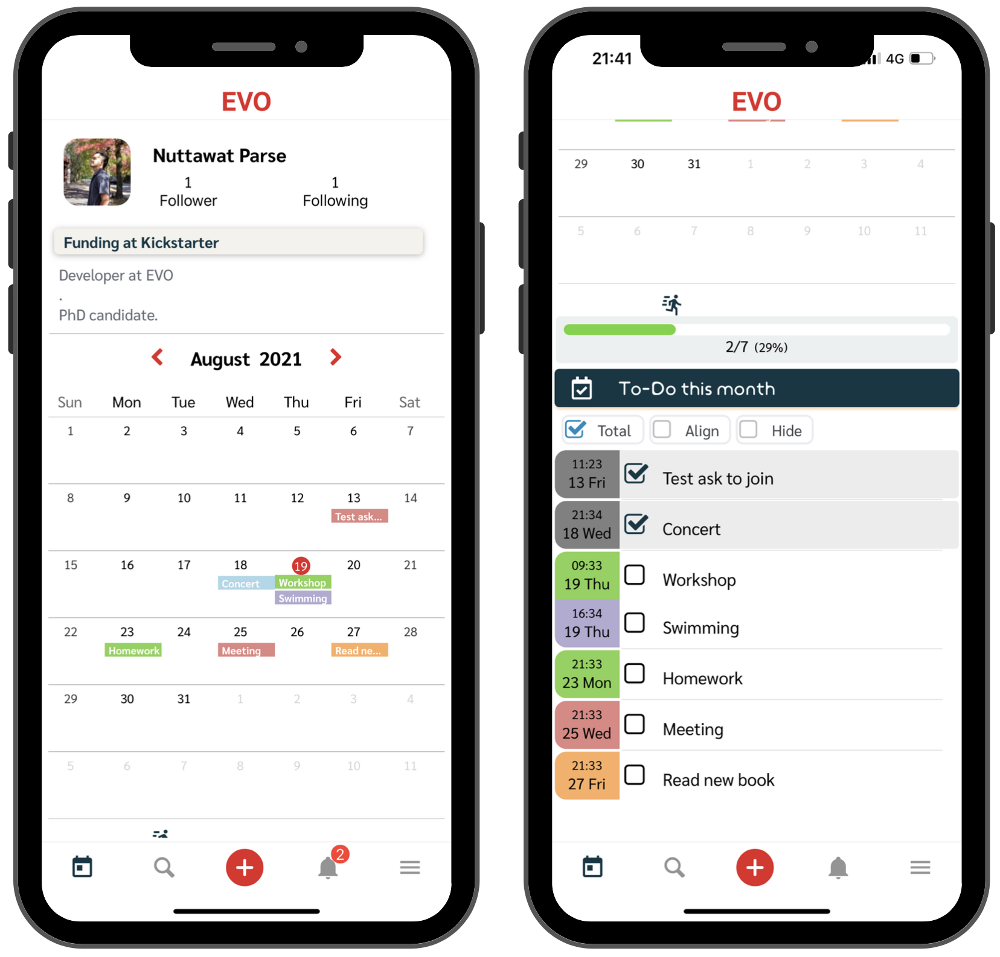
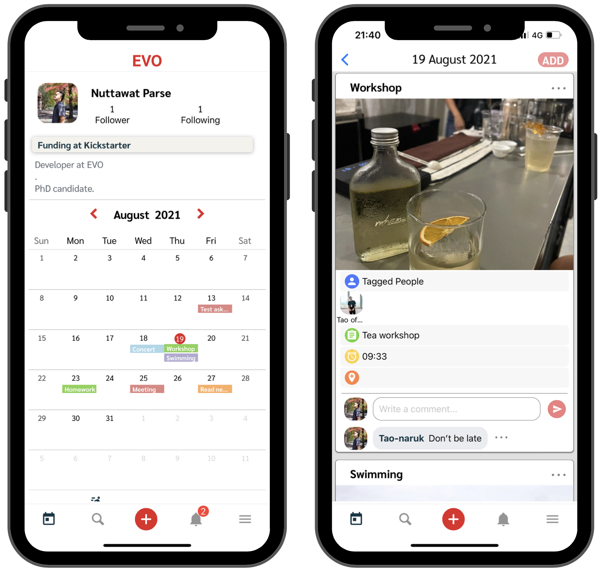
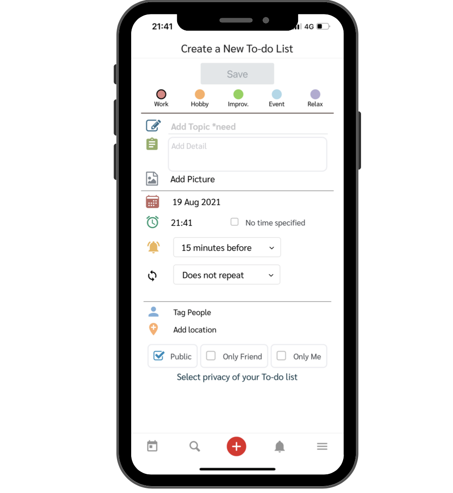
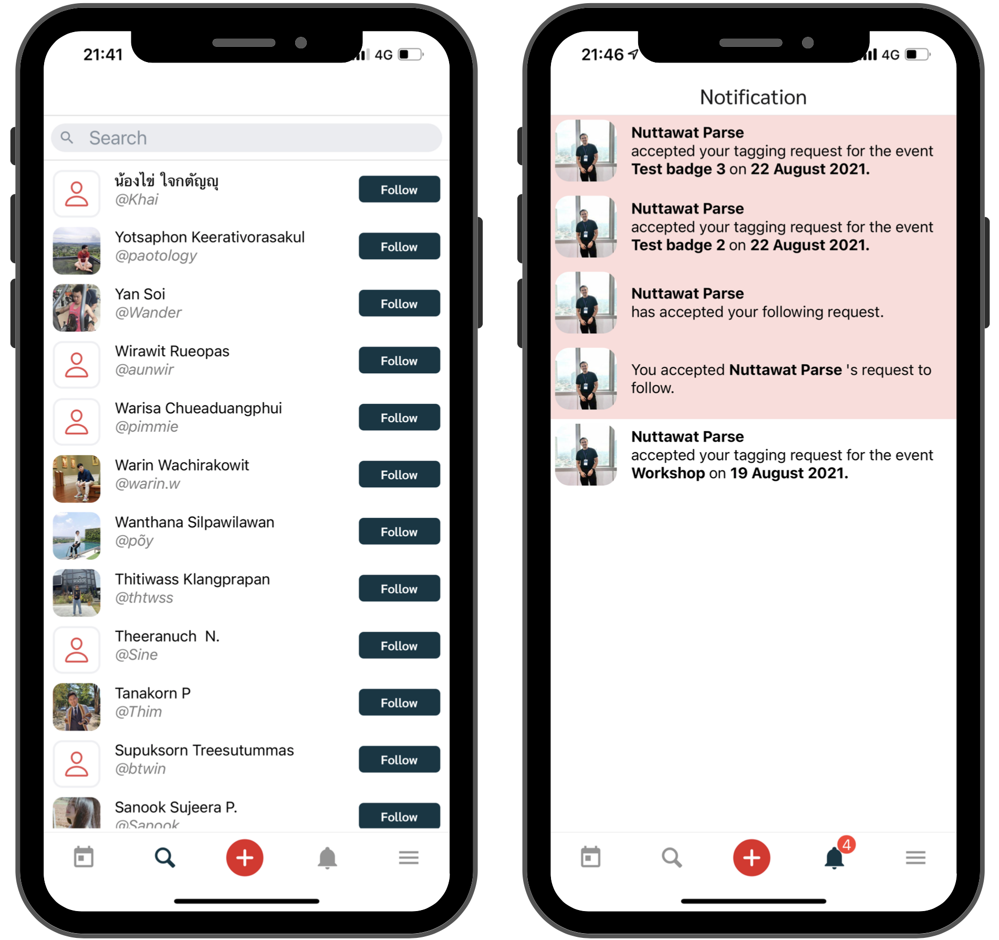

# Welcome to EVO social calendar

EVO offers an innovative planner book to help you to become more productive. Unlike traditional planner books, we provide the joyful one in a social media platform.

## Missions 

Our mission is to create a community of people who have goals, passions, and plans. We believe that there are no shortcuts to success, and we can achieve our goal by getting any necessary tasks done step by step, with good time management, which is very much like an evolution of yourself. This is why our application was named EVO.

## Key Features

### Simple interface
With simple interface, users can understand App working easily and see over screen of calendar quickly,

### Todo list
To keep you on the plan, To-do list for each month is in the same page of calendar, which is below.

### Deeper for the day 
If users click on the the day or to-do list, app will navigate you to timeline containing more details for each day. Furthermore, each posts as social media can comment for discussion.

### Create Event quickly
Very easy! With simple interface design, users can create event in 3 second. Or you can add more details for your event such as details, uploading photo, notification time, tagging friends, and adding location.

### Social interaction
To make a productive community, users can search for calendar of friends easily, and you can also view the planner of other users, which can help with the scheduling of any appointment. Furthermore, Notification screen will show what other users have interaction with you 

## Additional notes

We dream to have a community of users who respect and encourage the goals and passions of other people, and a community where users share their plans, and leave positive comments and feedback to motivate one another. Additionally, by being able to save your planner on the cloud storage, it can function like diary that you can use to look back at your memorable moments or events that you are so proud of.  

_We really hope that EVO can help make a difference for any of your self-development goal._

**“Be a better version of yourself, be EVO."**

## Contact us
- Tel. +66914137932 
- Email: evoinccontact@gmail.com

copyright 2021 Nuttawat Parse. All rights researved

